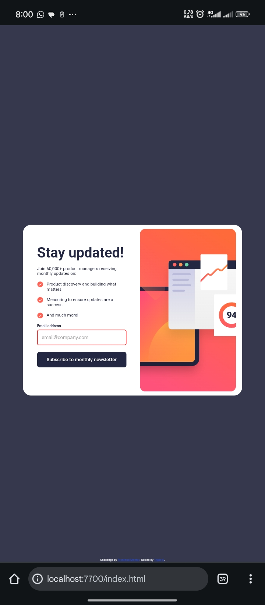
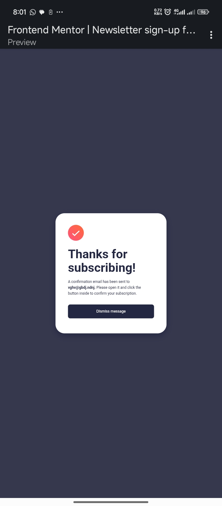

# Frontend Mentor - Newsletter sign-up form with success message solution

This is a solution to the [Newsletter sign-up form with success message challenge on Frontend Mentor](https://www.frontendmentor.io/challenges/newsletter-signup-form-with-success-message-3FC1AZbNrv). Frontend Mentor challenges help you improve your coding skills by building realistic projects. 

## Table of contents

- [Overview](#overview)
  - [The challenge](#the-challenge)
  - [Screenshot](#screenshot)
  - [Links](#links)
- [My process](#my-process)
  - [Built with](#built-with)
  - [What I learned](#what-i-learned)
  - [Continued development](#continued-development)
  - [Useful resources](#useful-resources)
- [Author](#author)


## Overview

### The challenge

Users should be able to:

- Add their email and submit the form
- See a success message with their email after successfully submitting the form
- See form validation messages if:
  - The field is left empty
  - The email address is not formatted correctly
- View the optimal layout for the interface depending on their device's screen size
- See hover and focus states for all interactive elements on the page

### Screenshot





### Links

- Solution URL: [Solution URL here](https://github.com/triplekdev/Newsletter-sign-up-with-success-message-main_practice)
- Live Site URL: [Live site URL here](https://newsletter-sign-up-practice.netlify.app/)

## My process

### Built with

- Semantic HTML5 markup
- CSS custom properties
- Flexbox
- Mobile-first workflow

### What I learned

I learnt a lot of things which I'll list below 👇 
- Usage of arrays and objects 
- Understanding the DOM better 
- Finding out how forms work and creating my own validation rules
- Use of Regular Expressions (regex)
- How to create a new page after submission using the template element 
- Designing with the Mobile-first workflow
- Error identification and debugging 
- Effective usage of media queries 
- Little yet adequate use of animations


Some HTML code I'm proud of:
```html
  <template id="success-template">
      <main class="success-section">
        
        <div class="success-msg">
          <h1 class="header">Thanks for subscribing!</h1>
          <p class="done">A confirmation email has been sent to <span class="user-email">ash@loremcompany.com.</span>Please open it and click the button inside to confirm your subscription.</p>
        </div>
        <button class="dismiss" onclick="location.reload()">Dismiss message</button>
      </main>
  </template>
```

Some CSS code I'm proud of:
```css
	.shake {
		animation: shake 0.8s ease-in-out;
	}
	
	@keyframes shake {
		0% {
			transform: translateX(-5px);
		}
		
		25% {
			transform: translateX(5px);
		}
		
		50% {
			transform: translateX(-5px);
		}
		
		75% {
			transform: translateX(5px);
		}
		
		100% {
			transform: translateX(0px);
		}
	}
```

Some JS code I'm proud of:
```js
emailInput.addEventListener('input', () => {
    // CRITICAL: Get the CURRENT value inside the listener
    const emailval = emailInput.value;
    
    const validationRules = [
    {
        test: (val) => /\s/.test(val),
        message: "Email cannot contain spaces."
    },
    {
        test: (val) => !val.includes('@'),
        message: "Email must contain an '@' symbol."
    },
    {
        test: (val) => {
            const parts = val.split('@');
            if (parts.length < 2) return false; // Let the '@' rule handle this
            const domain = parts[1];
            const domainParts = domain.split('.');
            const tld = domainParts[domainParts.length - 1];
            console.log(tld)
            return !domain.includes('.') ||
                domain.startsWith('.') ||
                domain.endsWith('.') ||
                tld.length < 2;
        },
        message: "Email must have a valid domain extension (e.g., .com or .io)."
    },
    {
        test: (val) => /[A-Z]/.test(val),
        message: "Email should not have capital letters."
    }];
    
    // Filter rules that return true (the "active" errors)
    const activeErrors = validationRules.filter(rule => rule.test(emailval));
    
    // 3. Output the results
    if (activeErrors.length > 0) {
        // Map the messages and join them with a break or comma 
        // so you see ALL of them, not just the last one.
        
        subscribe.disabled = true
        errors.innerText = activeErrors.map(err => err.message).join(" ");
    } else {
        // If no errors, clear the text
        subscribe.disabled = false
        errors.innerText = 'Email is valid✅';
    }
});
```

### Continued development

Looking for better ways to display errors to the user than the method I used.

### Useful resources

- [MDN Docs on client-side form validation](https://developer.mozilla.org/en-US/docs/Learn_web_development/Extensions/Forms/Form_validation) - This helped me understand the different form validation principles my form could follow.

## Author

- Github - [Triple K](https://github.com/triplekdev)
- Frontend Mentor - [@triplekdev](https://www.frontendmentor.io/profile/triplekdev)
- Twitter - [@3plkk](https://x.com/3plkk)